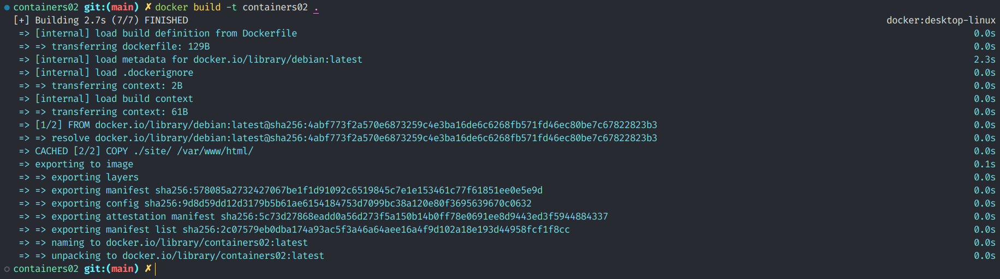
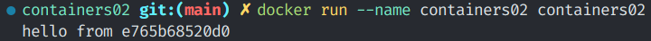
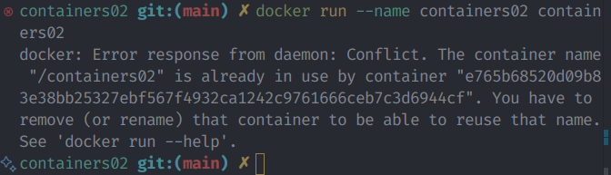
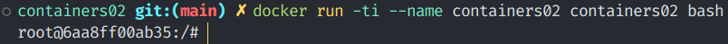
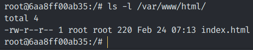
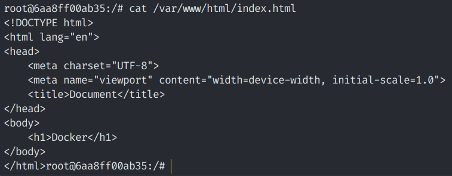

# Lucrare 3: Docker

> Realizat de studentul <u>Babacaev Renat, I2301</u>
> \
> Verificat de <u>Mihail Croitor</u>
>
> 24 Februarie 2025

## Scopul Lucrării

În acest laborator vom crea un container în sistemul de containerizare Docker.

Un container este un mediu izolat în care putem instala un sistem de operare mic care va gestiona aplicațiile și procesele în acest mediu.[^1] [^2]

## Sarcina

Vom instala Docker pe EndeavourOS, care este bazat pe Arch Linux. Cu Docker creăm container, rulăm câteva comenzi și accesăm fișier din acest repozitoriu ([folder-ul site](site/))

### Instalare

Instalăm Docker din repozitorie oficială și Docker Desktop din AUR[^3]

```bash
sudo pacman -S docker
```

Instalăm Docker Desktop cu ajutorul la `yay` care vine preinstalat în funcție de distribuitivul utilizat care este bazat pe Arch Linux (EndeavourOS vine preinstalat cu `yay`)

```bash
yay docker-desktop
1 aur/docker-desktop 4.38.0-1 (+15 1.38) (Installed)
    Docker Desktop is an easy-to-install application that enables you to locally build and share containerized applications and microservices.
==> Packages to install (eg: 1 2 3, 1-3 or ^4)
==> 
```

Alegem `1`, `Enter` `Enter` și instalăm pachetul.

Pornim serviciile docker:

```bash
sudo systemctl start docker.service docker.socket docker-desktop.service
```

### Crearea fișierelor

Creăm folder-ul `site` și în el un fișier `index.html` cu un header

```html
<h1>Docker</h1>
```

Creăm un Dockerfile cu acest conținut:

```Dockerfile
FROM debian:latest
COPY ./site/ /var/www/html/
CMD ["sh", "-c", "echo hello from $HOSTNAME"]
```

- `FROM`, prima instrucțiune din fișier indică ce trebuie dă fie descărcat pentru imagine. Imaginile se iau din [Docker Hub secțiunea Operating Systems](https://hub.docker.com/search?categories=Operating+Systems). Cu ea instalăm Debian
- `COPY` copie fișierele și folder-ele din repozitoria curentă în mașina virtuală. Copiem folder-ul `site` în `/var/www/html/`
- `CMD` executăm comenzile în container când acesta se pornește[^4]
  - `sh` shell-ul pe care container-ul îl va folosi. În acest caz `sh` (alternative mai avansate sunt `bash`, `zsh`, `fish`, etc...)
  - `-c` argument pentru `sh`. Acesta indică să execute următorul string ca comandă
  - `"echo hello from $HOSTNAME"` comanda executată după `-c`. `echo` afișează text în consolă. El va afișa `hello from $HOSTNAME`, unde `$HOSTNAME` este numele sistemului

## Pornire și Testare

Creăm container-ul

```bash
docker build -t containers02 .
```



Execuția a durat 2.7 secunde.

Pornim container-ul

```bash
docker run --name containers02 containers02
```



La ecran a fost afișat

```bash
hello from e765b68520d0
```

ID-ul este hostname-ul debian-ului care este în container

Vom avea nevoie să repornim container-ul. Ar fi logic să rulăm comanda precedentă, dar Docker va afișa eroare



Ștergem container-ul pentru a-l putea porni din nou

```bash
docker rm containers02
```

```bash
docker run -ti --name containers02 containers02 bash
```

Cu `-ti` intrăm în terminalul container-ului.



Verificăm dacă fișierul `index.html` s-a copiat în `/var/www/html/`

```bash
ls -l /var/www/html/
```



Precum vedem fișierul a fost copiat



Ieșim cu comanda `exit`

## Concluzie

Lucrarea dată ne familiarizează cu procesul de lucru cu containerele Docker.

Containerele oferă o modalitate comodă și eficientă de dezvoltare și rulare a aplicațiilor într-un mediu izolat de sistemul host, cu toate dependențele, librăriile și alte aplicații necesare. Astfel poate fi asigurată lucrul consistent al aplicațiilor iar în caz de vreo eroare, container-ul poate fi reinstalată împreună cu aplicația.

## Bibliografie

[^1]: [Reddit u,/mohelgamal](https://www.reddit.com/r/docker/comments/keq9el/comment/gg4f2dc/?utm_source=share&utm_medium=web3x&utm_name=web3xcss&utm_term=1&utm_content=share_button)
[^2]: [Docker Container](https://www.docker.com/resources/what-container/)
[^3]: [Arch Wiki AUR](https://wiki.archlinux.org/title/Arch_User_Repository)
[^4]: [Docker CMD](https://www.docker.com/blog/docker-best-practices-choosing-between-run-cmd-and-entrypoint/#:~:text=reduce%20image%20size.-,CMD,docker%20run,-.)
